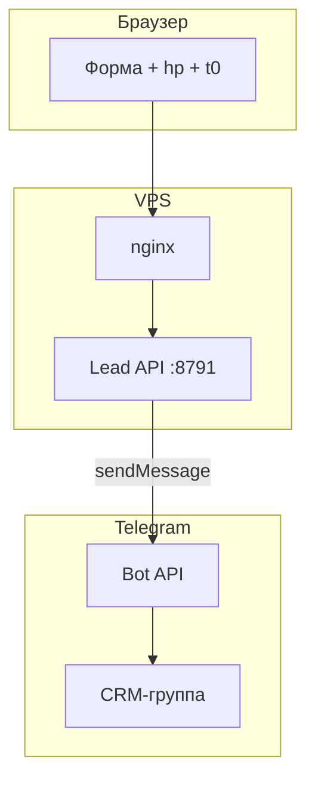
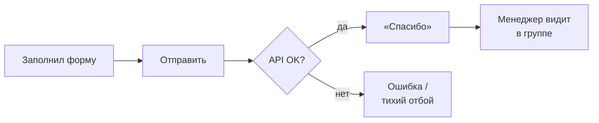
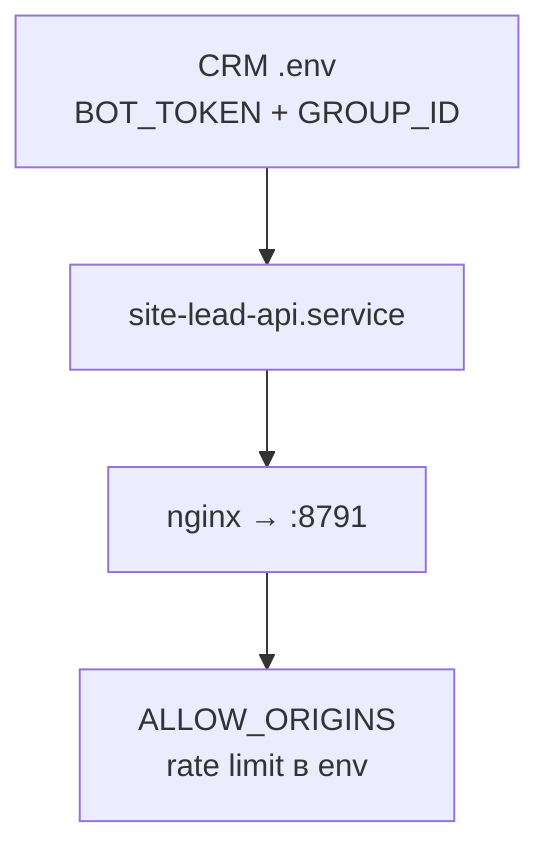

# Lead API — заявки с сайта в Telegram

Короче: **POST JSON → проверки → sendMessage в CRM-группу**, stdlib HTTP, без Django.

Задача: форма на статическом лендинге не должна тянуть тяжёлый бэкенд. Один endpoint за nginx, антиспам встроен.

---

## Что сделано

- **POST /api/lead** — имя, телефон, сообщение, honeypot, timestamp формы.
- **Rate limit по IP** — in-memory, на типичной нагрузке хватает.
- **Чтение BOT_TOKEN из CRM .env** — один токен на цепочку.
- **Threading / stdlib** — мало зависимостей, легко на VPS.

---

## Фишки и удобство

| Фишка | Зачем |
|-------|-------|
| `hp` honeypot | Боты заполняют — отбой |
| `t0` min/max ms | Слишком быстрая отправка = бот |
| 127.0.0.1:8791 | Только через nginx, не в интернет |
| CRM_ENV_PATH | Не дублировать секреты |
| JSON без PII в логах | Минимум утечек |

---

## Схема данных



---

## Процесс пользователя



**Администратор / DevOps:**



---

## Стек

| Слой | Технология |
|------|------------|
| HTTP | Python 3 http.server / uwsgi |
| Прокси | nginx |
| Telegram | urllib → sendMessage |
| CRM | общий .env |

---

## Структура репозитория

```
README.md
LICENSE
.gitignore
server/site_lead_server.py
deploy/site-lead-api.service
docs/                     — DIAGRAMS.md (3× mermaid)
examples/.env.example
```

---

## Быстрый старт

```bash
export CRM_ENV_PATH="/opt/telegram_crm_bot/.env"
export SITE_LEAD_LISTEN="127.0.0.1:8791"
python3 site_lead_server.py
```

nginx: `location /api/lead { proxy_pass http://127.0.0.1:8791; }`
